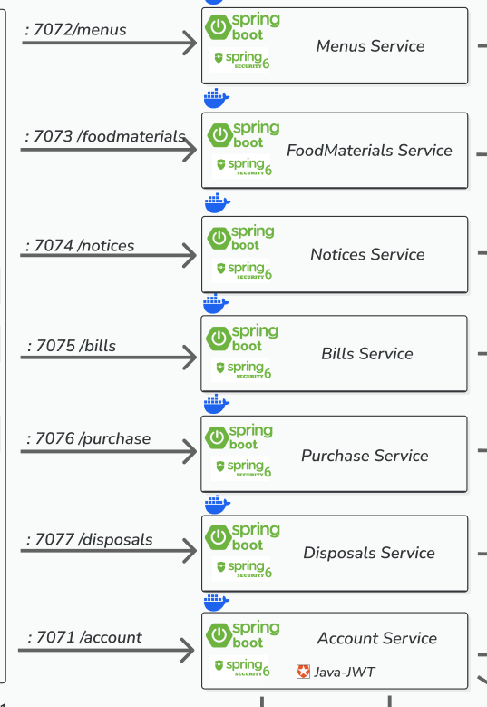

# 서비스 설계 기준과 실행 구성

사용자가 제공한 설계도의 서비스명·포트·기본 경로를 실제 프로젝트와 Gateway에 반영했다.
기준 계약은 [services.json](../architecture/services.json)이며, 아래 표는 업무 기능 완성 여부를 함께 표시한다.
`applicationName`은 그림의 표시명에서 공백을 제거한 코드 명명 규칙이다.



| 서비스 / 프로젝트 폴더 | 포트 | Gateway 기본 경로 | 구현 범위 |
|---|---:|---|---|
| AccountService | 7071 | `/account` | 기존 계정·인증·JWT 발행 |
| MenusService | 7072 | `/menus` | 독립 실행·Eureka·JWT·관측, 업무 API는 501 |
| FoodMaterialsService | 7073 | `/foodmaterials` | 기존 품목에서 이관한 기초 카탈로그 CRUD |
| NoticesService | 7074 | `/notices` | 독립 실행·Eureka·JWT·관측, 업무 API는 501 |
| BillsService | 7075 | `/bills` | 독립 실행·Eureka·JWT·관측, 업무 API는 501 |
| PurchaseService | 7076 | `/purchase` | 독립 실행·Eureka·JWT·관측, 업무 API는 501 |
| DisposalsService | 7077 | `/disposals` | 독립 실행·Eureka·JWT·관측, 업무 API는 501 |

각 폴더에 Gradle 프로젝트·Application 클래스·application.yaml·Dockerfile이 있다.
Gateway의 공개 업무 라우트는 위 7개이며 `/purchase`는 단수, `/foodmaterials`는 붙여 쓴 소문자다.
서비스 이름을 Eureka 대상 URI로 사용한다. Gateway는 7070, Eureka는 8761을 유지한다.

## 기존 기능의 처리

- `ItemService` 폴더·패키지·Application·도메인 Java 타입을 FoodMaterials 명칭으로 이관했다.
- `/items`는 `/foodmaterials`로 바뀌었다. 상세 응답의 `itemId`는 `foodMaterialId`, 목록의 `items`는 `foodMaterials`다.
- 공개 오류 코드도 `FOOD_MATERIAL_NOT_FOUND`, `FOOD_MATERIAL_CONFLICT` 등으로 변경했다. 호출자는 경로와 응답 필드·코드를 함께 변경해야 한다.
- 이전 `itemdb.item`과 Flyway V1/V2 SQL은 그대로 유지한다. 기존 데이터를 새로운 빈 DB로 바꾸거나 migration checksum을 변경하지 않는다.
- `/items`, `/inventories`, `/orders`는 Gateway의 공개 업무 라우트에서 제외했다.

FoodMaterials는 SKU·이름·설명·단가·상태·계정 소유권의 기초 카탈로그다. 단위·유통기한·레시피 등의 업무 기능을
그림만 보고 새로 확정하거나 구현하지 않았다. 기존 CRUD가 있다는 사실을 전체 식자재 요구사항 완성으로 해석하지 않는다.

## 설계도 외 서비스 제거

사용자 요청에 따라 AuditService와 InventoryService 폴더, Compose 서비스, Eureka 등록 설정,
Jenkins 단계, 환경변수 예제 및 모니터링 대상을 제거했다. 업무 서비스는 위 7개만 둔다.
기존 감사 저장·소비자 중복 방지·DLT 처리와 현재고·수량 조정·변경 원장 API는 더 이상 제공하지 않는다.
이 기능을 Menus·Notices 등 다른 서비스의 구현으로 간주하지 않는다.
Account의 Outbox와 Kafka 이벤트 발행은 유지하지만 현재 업무 소비자는 없다.

기존 `auditdb`, `inventorydb`와 데이터 볼륨은 삭제하거나 초기화하지 않는다.
새 환경에서는 두 스키마를 생성하지 않는다. 이전 코드와 migration은 Git 이력에서 확인한다.
2026-09-15의 [전환 검증](service-transition-results.md)은 제거 전 구성의 기록이다.
현재 구성의 검증 범위는 [7개 서비스 정리 결과](service-topology-cleanup.md)를 따른다.

## 신규 서비스의 인증과 미구현 계약

Menus·Notices·Bills·Purchase·Disposals는 `shared/service-foundation`을 통해 공개키 JWT 검증과 관측을 공유한다.
개인키는 Account만 받는다. 신규 서비스의 기본 경로는 인증이 없으면 401, 정상 Access Token이면
`501 ENDPOINT_NOT_IMPLEMENTED`를 반환한다. 정상 업무 데이터나 성공한 쓰기 응답을 만들어 내지 않는다.
서비스 기동/health 200과 업무 API 완성은 다르다. 다섯 서비스의 업무 기능을 구현할 때 공통 pending controller를
제거/대체하고 해당 서비스의 권한·데이터·업무 테스트를 추가해야 한다.

확인이 필요한 업무 규칙은 메뉴와 식자재의 연결, 식자재 단위/재고 소유권, 공지 권한, Bills의 실제 의미,
Purchase의 입고 확정 시점, Disposals의 폐기/차감 규칙이다. 주문 서비스·결제·승인 흐름을 임의로 추가하지 않는다.

## 기존 환경 전환

1. `.env`의 `ITEM_DB_*`, `ITEM_SERVER_PORT`, `ITEM_FLYWAY_BASELINE_ON_MIGRATE`를 대응하는
   `FOOD_MATERIAL_DB_*`, `FOOD_MATERIAL_SERVER_PORT`, `FOOD_MATERIAL_FLYWAY_BASELINE_ON_MIGRATE`로 옮긴다.
   제거된 서비스의 `AUDIT_*`, `INVENTORY_*`, `FOOD_MATERIAL_SERVICE_BASE_URL`, `KAFKA_AUDIT_GROUP_ID`,
   `KAFKA_ACCOUNT_LIFECYCLE_DLT_TOPIC` 설정은 현재 구성에서 사용하지 않는다.
2. 기존 Compose 프로젝트의 컨테이너와 제거된 서비스의 orphan 컨테이너를 볼륨 보존 상태로 종료한다. 아래 명령은 해당 프로젝트의 서비스 중단을 포함한다.
3. 새 이미지로 시작한다. 기존 item-service는 포트 충돌을, audit-service·inventory-service는 불필요한 실행을 일으킬 수 있다.

```bash
docker compose down --remove-orphans
docker compose up -d --build --wait
```

`down -v`로 기존 데이터를 지우지 않는다. 이 작업에서는 기존 업무 환경에 위 명령을 실행하지 않고 격리 실험 환경만 검증한다.
IDE 실행 설정도 `FoodMaterialsService` 프로젝트와 새 Application 클래스로 변경한다.

## 검증과 재발 방지

```bash
python3 scripts/verify-service-architecture.py
python3 scripts/verify-service-architecture.py --ci
python3 scripts/verify-service-architecture.py --performance
```

검사기는 정확히 7개 업무 폴더·Compose 구성·서비스 이름·포트·Gateway 경로·공개키 전용 마운트와 9개 Spring 모니터링 대상을 확인한다.
Compose 기본·CI·실험 설정과 Prometheus/Grafana 대상, Jenkins 테스트/이미지/경로 검증도 새 구성으로 갱신했다.
Jenkins는 신규 API의 예상 결과를 501로 검사한다. 원격 CI 실행 여부는 별도 검증 결과에 표시한다.

기존 [스프린트 결과](sprint4-results.md)의 Item/Inventory 성능 수치는 당시 구현·토폴로지의 기록이다.
이번 이름/경로 전환의 성능 수치로 재사용하지 않는다. 전환 검증은 [전환 결과](service-transition-results.md)에 기록한다.
실험 요약기는 기본적으로 결과 폴더에 summary.json을 만들며 기존 공개 보고서를 자동 덮어쓰지 않는다.

검토 후 보완은 세 가지다: 서비스 계약 자동 검사, 미구현 기능의 명시적 501, 기존 migration/데이터 보존이다.
라우트 ID·URI·Path의 구분은 [Spring Cloud Gateway 공식 문서](https://docs.spring.io/spring-cloud-gateway/reference/spring-cloud-gateway-server-webmvc/glossary.html),
공유 모듈 구성은 [Gradle 공식 문서](https://docs.gradle.org/current/userguide/multi_project_builds.html)를 참고했다.
서비스명·포트·업무 범위의 기준은 사용자 설계도다.
